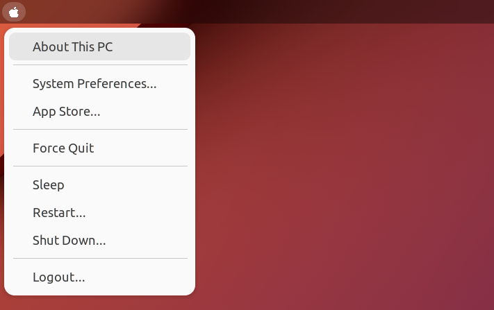

# Maccy Menu

### Screenshot Preview

### Installation
You can install this extension by:
- Install from [GNOME Extensions](https://extensions.gnome.org/extension/6021/maccy-menu/) hub.
- or Search for **Maccy Menu** in GNOME Shell Extension Desktop Application.
